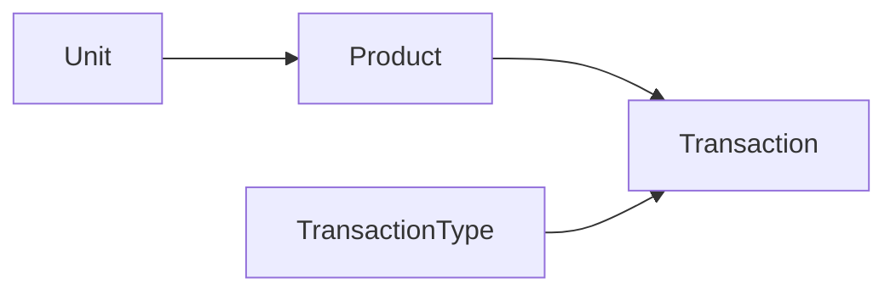

# Bravo.InventorySystem

### Domain Layer

- Contiene las entidades del dominio

### Application Layer

- Contiene la implementación de la lógica de negocio y sus reglas, así como dependencias necesarias en formas de interfaces para su ejecución
- Fue creado un único servicio (ProductService) el cual contiene las operaciones necesarias y sus validaciones
- Las transacciones se realizaran de acuerdo al tipo de transacción elegida y esta aplicara una acción de adicción o substracción

### Persistence Layer

- Define la base de datos a utilizar (MSSQL) y contiene las configuraciones necesarias para su creación
- Datos ingresados
  - [Unit] - Unidad, Docena
  - [TransactionType] Entrada +, Modificar +, Modificar -, Mermas -

### WebApi Layer

- Contiene expuestos los recursos necesarios para poder ser consumidos
- HistoryController: se encarga de devolver el histórico de transacciones de los productos
  - [GET] api/history/{id} - retorna el historial de un producto (id)
  - [GET] api/history/{id}/losses - retorna el historial de mermas de un producto (id)
- ProductController: se encarga de la creación de productos y el listado de los mismos con su cantidad actual
  - [GET] api/product - retorna la lista de productos y sus cantidades actualizadas
  - [POST] api/prodcut - inserta un nuevo producto
- TransactionController: se encarga de registrar las transacciones
  - [POST] api/transaction - inserta una nueva transacción en la cual se define el tipo de transición a realizar

